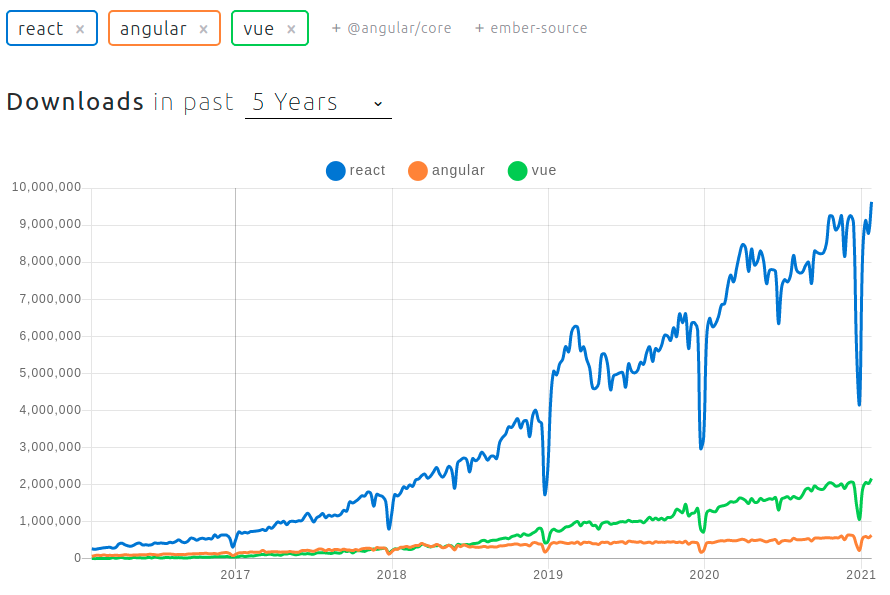

# IDOM - It's React, but in Python

[IDOM](https://github.com/idom-team/idom) is a new declarative Python package for
building highly interactive user interfaces.


IDOM takes inspiration from [React](https://reactjs.org/), and wherever possible,
attempts to achieve parity with the features it copies more directly. Nowhere is this
more evident than the version of React's often lauded
["Hooks"](https://reactjs.org/docs/hooks-intro.html) that IDOM implements in Python.

At a glance, the similarities between IDOM and React are rather striking. Below is a
React component which defines a simple `Counter` displaying the number of times a button
has been clicked:

```jsx
import React, { useState } from "react";
import ReactDOM from "react-dom";

function Counter() {
  const [count, setCount] = useState(0);
  return (
    <div>
      <button onClick={() => setCount(count + 1)}>Click me!</button>
      <p>{`Click count: ${count}`}</p>
    </div>
  );
}

ReactDOM.render(<Counter />, document.getElementById("root"));
```

And this is the same component implemented in Python using IDOM:

```python
import idom

@idom.component
def Counter():
    count, set_count = idom.hooks.use_state(0)
    return idom.html.div(
        idom.html.button(
            {"onClick": lambda event: set_count(count + 1)},
            "Click me!"
        ),
        idom.html.p(f"Click count: {count}")
    )

idom.run(Counter)
```

Which, when displayed in your browser, should look something like this:

{: .center .shadow}

## Why Do We Need IDOM?

Over the [past 5 years](https://www.npmtrends.com/react-vs-angular-vs-vue) front-end
developers seem to have concluded that programs written with a declarative style or
framework tend to be easier understand and maintain than those done imperatively. Put
more simply, mutable state in programs can quickly lead to unsustainable complexity.
This trend is largely evidenced by the
[rise](https://gist.github.com/tkrotoff/b1caa4c3a185629299ec234d2314e190) of Javascript
frameworks like [Vue](https://vuejs.org/) and [React](https://reactjs.org/) which
describe the logic of computations without explicitly stating their control flow.



So what does this have to do with Python and IDOM? Well, because browsers are the de
facto "operating system of the internet", even back-end languages like Python have had
to figure out clever ways to integrate with them. While standard
[REST](https://en.wikipedia.org/wiki/Representational_state_transfer) APIs are well
suited to applications built using HTML templates, modern browser users expect a higher
degree of interactivity than this alone can achieve.

A variety of Python packages have since been created to help solve this problem:

- [IPyWidgets](https://github.com/jupyter-widgets/ipywidgets) - Adds interactive widgets
  to [Jupyter Notebooks](https://jupyter.org/)
- [Dash](https://plotly.com/dash/) - Allows data scientists to produces enterprise-ready
  analytic apps
- [Streamlit](https://www.streamlit.io/) - Turns simple Python scripts into interactive
  dashboards
- [Bokeh](https://docs.bokeh.org/) - An interactive visualization library for modern web
  browsers

However they each have drawbacks that can make them difficult to use.

3. **Restrictive ecosystems** - UI components developed for one framework cannot be
   easily ported to any of the others because their APIs are either too complex,
   undocumented, or are structurally inaccesible.

1. **Imperative paradigm** - IPyWidgets and Bokeh have not embraced the same declarative
   design principles pioneered by front-end developers. Streamlit and Dash on the
   otherhand, are declarative, but fall short of the features provided by React or Vue.

1. **Limited layouts** - At their initial inception, the developers of these libraries
   were driven by the visualization needs of data scientists so the ability to create
   complex UI layouts may not have been a primary engineering goal.

A future article will address specific comparisons to each of the projects mentioned
above, but for now, we'll just focus on IDOM and its solutions to the problems above.

## Ecosystem Independence

IDOM has a flexible set of core abstractions that allow it to interface with its peers.
At the time of writing, both Jupyter and Dash are supported, while Streamlit and Bokeh
are in the works:

- [idom-jupyter](https://github.com/idom-team/idom-jupyter) (try it now with
  [Binder](https://mybinder.org/v2/gh/idom-team/idom-jupyter/main?filepath=notebooks%2Fintroduction.ipynb))
- [idom-dash](https://github.com/idom-team/idom-dash)

By providing well defined interfaces and straighforward protocols, IDOM makes it easy to
swap out any part of the stack with an alternate implementation if you want to. For
example, if you need a different web server for your application, IDOM already has 3
options to choose from or, use as blueprints to create your own:

- [Sanic](https://github.com/sanic-org/sanic)
- [Flask](https://github.com/pallets/flask)
- [Tornado](https://github.com/tornadoweb/tornado)

You can even target your usage of IDOM in your production-grade applications with IDOM's
Javascript [React client library](https://github.com/idom-team/idom-client-react). Just
install it in your front-end app and connect a back-end websocket that's serving up IDOM
models. IDOM's own [documentation](https://idom-docs.herokuapp.com/docs/index.html) acts
as a prime example for this targeted usage - most of the page is static HTML, but
embedded in it are interactive examples that feature live views being served from a web
socket:

{: .shadow}

## Declarative Components

IDOM, by adopting the hook design pattern from React, inherits many of its aesthetic and
functional characteristics. For those unfamiliar with hooks, user interfaces are
composed of basic [HTML elements](https://en.wikipedia.org/wiki/HTML_element) that are
constructed and returned by special functions called "components". Then, through the
magic of hooks, those component functions can be made to have state. Consider the
component below which displays a basic representation of an
[AND-gate](https://en.wikipedia.org/wiki/AND_gate):

```python
import idom

@idom.component
def AndGate():
    input_1, toggle_1 = use_toggle()
    input_2, toggle_2 = use_toggle()
    return idom.html.div(
        idom.html.input(
            {"type": "checkbox", "onClick": lambda event: toggle_1()}
        ),
        idom.html.input(
            {"type": "checkbox", "onClick": lambda event: toggle_2()}
        ),
        idom.html.pre(f"{input_1} AND {input_2} = {input_1 and input_2}"),
    )

def use_toggle():
    state, set_state = idom.hooks.use_state(False)

    def toggle_state():
        set_state(lambda old_state: not old_state)

    return state, toggle_state

idom.run(AndGate)
```

{: .center .shadow}

Here's a very high level summary of how it works... the first time a view of the
component above is rendered, the `AndGate` function is called where its initial `state`
for `input_1` and `input_2` is `False`. The function then returns a series of HTML
elements with callbacks that respond to client-side events. Machinery behind the scenes
subsequently realizes that declaration and displays two checkbox buttons with the text
`False AND False = False`. Later, when a user clicks the now visible checkbox buttons,
client-side events are triggered, the associated callbacks respond by inverting the old
`state` from `False` to `True`, and a re-render of the component is scheduled. When
re-rendering, the function is again called, this time though, where `input_1` and
`input_2` have been updated to reflect the new `state`, thus causing the displayed text
to change.

In the code above, consider the fact that it never explicitely describes how to evolve
the frontend view when events occur. Instead, it declares that, given a particular
state, this is how the view should look. It's then IDOM's responsibility to figure out
how to bring that declaration into being. This behavior of defining outcomes without
stating the means by which to achieve them is what makes components in IDOM and React
"declarative". For comparison, a hypothetical, and a more imperative approach to
defining the same interface might look similar to the following:

```python
layout = Layout()

def make_and_gate():
    state = {"input_1": False, "input_2": False}
    output_text = html.pre()
    update_output_text(output_text, state)

    def toggle_input(index):
      state[f"input_{index}"] = not state[f"input_{index}"]
      update_output_text(output_text, state)

    return html.div(
        html.input(
            {"type": "checkbox", "onClick": lambda event: toggle_input(1)}
        ),
        html.input(
            {"type": "checkbox", "onClick": lambda event: toggle_input(2)}
        ),
        output_text
    )

def update_output_text(text, state):
    text.update(
        children="{input_1} AND {input_2} = {output}".format(
            input_1=state["input_1"],
            input_2=state["input_2"],
            output=state["input_1"] and state["input_2"],
        )
    )

layout.add_element(make_and_gate())
layout.run()
```

In this imperative incarnation there are several disadvantages:

1. **Refactoring is difficult** - Functions are much more specialized to their
   particular usages in `make_and_gate` and thus cannot be easily generalized. By
   comparison, `use_toggle` from the declarative implementation could be applicable to
   any scenario where boolean indicators are toggled on and off.

2. **No clear static relations** - There is no one section of code through which one can
   discern the basic structure and behaviors of the view. This issue is exemplified by
   the fact that we must call `update_output_text` from two different locations. Once in
   the body of `make_and_gate` and again in the body of the callback `toggle_input`.
   This means that, to understand what the `output_text` might contain, we must also
   understand all the business logic that surrounds it.

3. **Referential links cause complexity** - To evolve the view, various callbacks must
   hold references to all the elements that they will update. At the outset this makes
   writing programs difficult since elements must be passed up and down the call stack
   wherever they are needed. Considered further though, it also means that a function
   layers down in the call stack can accidentally or intentionally impact the behavior
   of ostensibly unrelated parts of the program.

## Virtual Document Object Model

To communicate between their back-end Python servers and Javascript clients, IDOM's
peers take an approach that aligns fairly closely with the
[Model-View-Controller](https://en.wikipedia.org/wiki/Model%E2%80%93view%E2%80%93controller)
design pattern - the controller lives server-side (though not always), the model is
what's synchronized between the server and client, and the view is run client-side in
Javascript. To draw it out might look something like this:

{: .center}

By contrast, IDOM uses something called a Virtual Document Object Model
([VDOM](https://idom-docs.herokuapp.com/docs/specifications.html#vdom-mimetype)) to
construct a representation of the view. The VDOM is constructed on the Python side by
components then, as it evolves, IDOM's layout computes VDOM-diffs and wires them to its
Javascript client where it is ultimately displayed:

{: .center}

This process, in addition to drastically reducing complexity, means that Python
developers with just a little bit of HTML and CSS knowledge can easily create elabortate
interfaces because they have complete control over the view. Of course many users
probably don't care about the details and just want high level components, but for those
who do, it's easy to distribute their creations for others to use in Python packages.

## Custom Javascript Components

If you're thinking critically about IDOM's use of a virtual DOM, you may have thought...

> Isn't wiring a virtual representation of the view to the client, even if its diffed,
> expensive?

And yes, while the performance of IDOM is sufficient for most use cases, there are
inevitably scenarios where this could be an issue. Thankfully though, just like its
peers, IDOM makes it possible to seemlesly integrate
[Javascript components](https://idom-docs.herokuapp.com/docs/javascript-components.html).
They can be custom built for your use case, or you can just leverage the existing
Javascript ecosystem without any extra work:

```python
import json
import idom

material_ui = idom.install("@material-ui/core", fallback="loading...")

@idom.component
def DisplaySliderEvents():
    event, set_event = idom.hooks.use_state(None)
    return idom.html.div(
        material_ui.Slider(
            {
                "color": "primary",
                "step": 10,
                "min": 0,
                "max": 100,
                "defaultValue": 50,
                "valueLabelDisplay": "auto",
                "onChange": lambda *event: set_event(event),
            }
        ),
        idom.html.pre(json.dumps(event, indent=2)),
    )

idom.run(DisplaySliderEvents)
```

{: .center .shadow}

## Conclusion

Building highly interactive web applications as a Python developer has historically been
a great challenge. However IDOM changes that. Knowing just basic HTML, CSS, and Python,
you can make everything from
[slideshows](https://idom-docs.herokuapp.com/docs/examples.html#slideshow) to
[dashboards](https://idom-docs.herokuapp.com/docs/examples.html#simple-dashboard) and
use it wherever you need it, whether that's in a
[Jupyter Notebook](https://github.com/idom-team/idom-jupyter)
or an existing web application.

To learn more check out:

- [the source code](https://github.com/idom-team/idom)
- [installation instructions](https://idom-docs.herokuapp.com/docs/installation.html)
- [how to make your first component](https://idom-docs.herokuapp.com/docs/getting-started.html)
- [interactive examples](https://idom-docs.herokuapp.com/docs/examples.html)
- [and much more](https://idom-docs.herokuapp.com/docs/index.html)!
